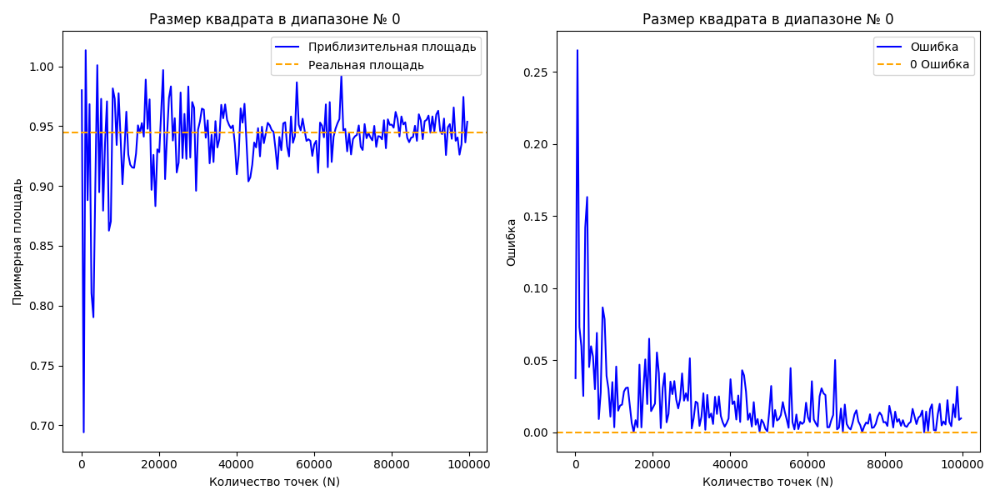
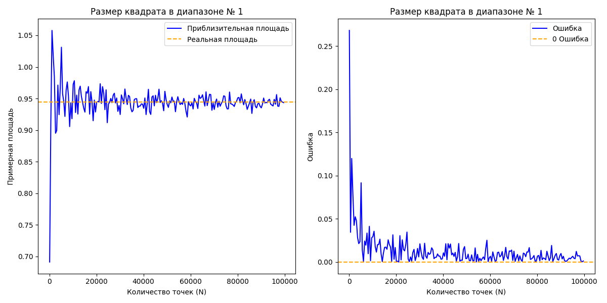
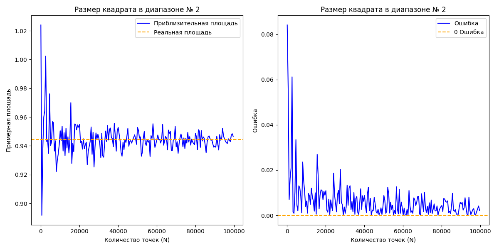

## Результаты и выводы

Данный проект посвящен исследованию эффективности метода Монте-Карло для приближенного вычисления площади пересечения трех кругов.  Были реализованы алгоритмы на C++, генерирующие случайные точки в трех прямоугольных областях разного размера: большая (0, 3.5), средняя (0.3, 2.7) и малая (0.7, 2.3), охватывающих область пересечения. Для каждой области было проведено  вычисление площади при количестве точек N от 100 до 100000 с шагом 500.

### Визуализация результатов работы:
* Графики найденной площади и значение ошибки при большой площади

* Графики найденной площади и значение ошибки при средней площади

* Графики найденной площади и значение ошибки при малой площади

### Основные наблюдения:

* **Сходимость к точному значению:**  Как видно из графиков, с увеличением числа точек N приближенное значение площади стремится к точному значению.  Это подтверждает  теоретические основы метода Монте-Карло.
* **Влияние размера области:**  Размер прямоугольной области, в которой генерируются точки, оказывает существенное влияние на скорость сходимости.  Чем меньше область (и чем ближе она по форме к целевой фигуре), тем быстрее сходится метод и меньше относительная ошибка при фиксированном N. Это объясняется тем, что  "лишние" точки, попадающие за пределы пересечения,  вносят больший вклад в ошибку, когда область генерации большая.
* **Флуктуации:**  Наблюдаются небольшие флуктуации  приближенного значения площади и относительной ошибки, особенно при малых N.  Это связано со случайной природой метода.

### Выводы:

* Метод Монте-Карло позволяет эффективно оценивать площадь сложных фигур, таких как пересечение кругов.
* Точность метода возрастает с увеличением числа генерируемых точек N.
* Выбор  области генерации точек существенно влияет на эффективность метода.  Чем меньше область и чем ближе она по форме к целевой фигуре, тем быстрее достигается заданная точность.

### Другое
* id посылки на codeforces: [292898085](https://dsahse.contest.codeforces.com/group/NOflOR1Qt0/contest/565612/submission/292898085)
